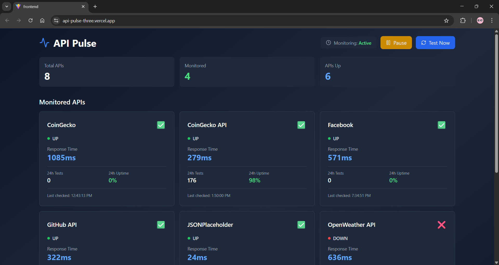
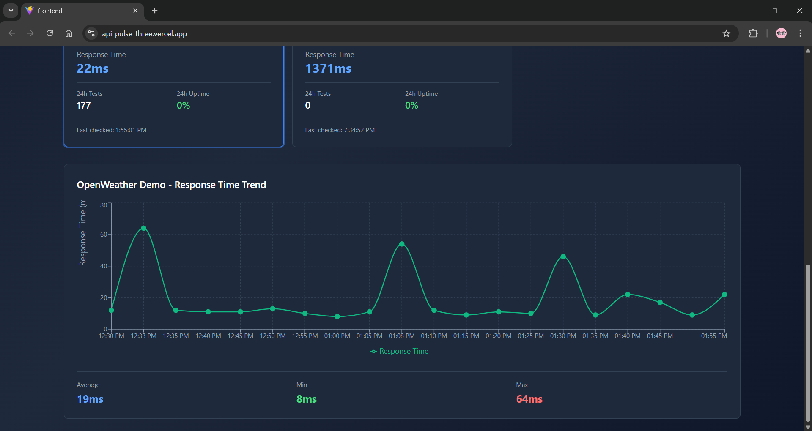
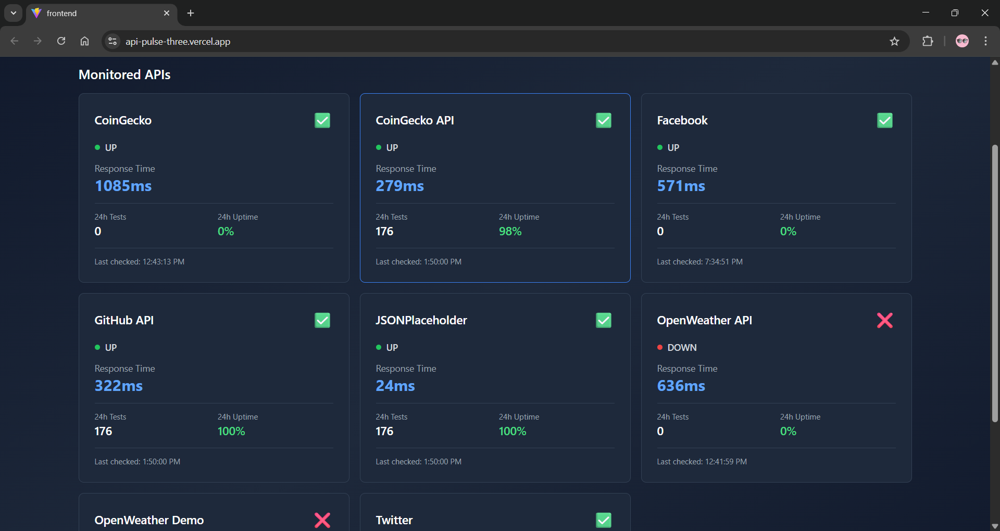

# API Pulse 🚀

[](https://api-pulse-three.vercel.app)
[](https://api-pulse-production.up.railway.app)
[](https://github.com/Sridhar-r-27/api-pulse)

**Real-time API Monitoring & Health Check System**

A production-ready full-stack application that monitors API health, tracks response times, and provides detailed analytics with beautiful data visualizations.

[🌐 Live Demo](https://api-pulse-three.vercel.app) • [📡 Backend API](https://api-pulse-production.up.railway.app/health) • [👨‍💻 Developer](https://linkedin.com/in/sridhar-r-116543222)

---

## 📸 Screenshots

> Add your screenshots here after taking them:
> 
> **Dashboard Overview**
> 
> 
> **Response Time Charts**
> 
> 
> **API Details**
> 

---

## ✨ Features

### Core Functionality
- ✅ **Automated Monitoring** - Tests APIs every 5 minutes in the background
- ✅ **Real-time Dashboard** - Live updates with 30-second auto-refresh
- ✅ **Data Visualization** - Interactive charts showing response time trends
- ✅ **Manual Controls** - Test now button, pause/resume monitoring
- ✅ **Historical Data** - Track API performance over time
- ✅ **Bulk Testing** - Test multiple APIs simultaneously
- ✅ **Statistics & Analytics** - Uptime %, avg response times, min/max values

### Technical Highlights
- ✅ 12 RESTful API endpoints
- ✅ Background job scheduling with node-cron
- ✅ Cloud database with MongoDB Atlas (50,000+ test records)
- ✅ Responsive UI with Tailwind CSS
- ✅ Production deployment on Railway & Vercel
- ✅ Error handling and data validation
- ✅ MVC architecture pattern

---

## 🚀 Live Application

**Frontend:** https://api-pulse-three.vercel.app  
**Backend API:** https://api-pulse-production.up.railway.app  
**Health Check:** https://api-pulse-production.up.railway.app/health

### Test the API Endpoints

```bash
# Get all API summary
curl https://api-pulse-production.up.railway.app/api/summary

# Get latest test results
curl https://api-pulse-production.up.railway.app/api/tests

# Get scheduler status
curl https://api-pulse-production.up.railway.app/api/scheduler/status

# Trigger manual test
curl -X POST https://api-pulse-production.up.railway.app/api/scheduler/trigger
```

---

## 🛠️ Tech Stack

### Frontend
- **React 18** - Component-based UI library
- **Vite** - Fast build tool and dev server
- **Tailwind CSS** - Utility-first CSS framework
- **Recharts** - Composable charting library
- **Axios** - Promise-based HTTP client
- **Lucide React** - Beautiful icon set

### Backend
- **Node.js** - JavaScript runtime
- **Express.js** - Web application framework
- **MongoDB & Mongoose** - NoSQL database and ODM
- **node-cron** - Task scheduler for background jobs
- **Axios** - HTTP client for testing APIs
- **CORS** - Cross-origin resource sharing
- **dotenv** - Environment variable management

### DevOps & Deployment
- **Vercel** - Frontend hosting with CDN
- **Railway** - Backend hosting and deployment
- **MongoDB Atlas** - Cloud database service
- **Git & GitHub** - Version control
- **Postman** - API testing and documentation

---

## 📊 System Architecture

```
┌─────────────────┐
│   User Browser  │
└────────┬────────┘
         │
         ↓
┌─────────────────────────────────────┐
│   Vercel (Frontend - React)         │
│   - Dashboard UI                    │
│   - Charts & Visualizations         │
│   - Real-time Updates               │
└────────┬────────────────────────────┘
         │ HTTPS
         ↓
┌─────────────────────────────────────┐
│   Railway (Backend - Node.js)       │
│   ┌───────────────────────────────┐ │
│   │  Express API Server           │ │
│   │  - 12 RESTful Endpoints       │ │
│   │  - Request Validation         │ │
│   │  - Error Handling             │ │
│   └───────────┬───────────────────┘ │
│               │                      │
│   ┌───────────▼───────────────────┐ │
│   │  Background Scheduler         │ │
│   │  - Tests APIs every 5 min     │ │
│   │  - Stores results in DB       │ │
│   └───────────┬───────────────────┘ │
└───────────────┼─────────────────────┘
                │
                ↓
┌─────────────────────────────────────┐
│   MongoDB Atlas (Database)          │
│   - API Test Results Collection     │
│   - 50,000+ Test Records            │
│   - Indexed for Fast Queries        │
└─────────────────────────────────────┘
```

---

## 🗂️ Project Structure

```
api-pulse/
├── backend/
│   ├── src/
│   │   ├── config/
│   │   │   ├── apis.js           # APIs to monitor
│   │   │   └── database.js       # MongoDB connection
│   │   ├── models/
│   │   │   └── ApiTest.js        # Test result schema
│   │   ├── services/
│   │   │   ├── apiTestService.js # API testing logic
│   │   │   └── schedulerService.js # Background scheduler
│   │   ├── controllers/
│   │   │   ├── apiTestController.js  # Request handlers
│   │   │   └── schedulerController.js
│   │   ├── routes/
│   │   │   ├── apiTestRoutes.js  # API endpoints
│   │   │   └── schedulerRoutes.js
│   │   └── server.js             # Application entry point
│   ├── .env                      # Environment variables
│   ├── .gitignore
│   ├── package.json
│   └── README.md
│
├── frontend/
│   ├── src/
│   │   ├── components/
│   │   │   └── ResponseTimeChart.jsx # Chart component
│   │   ├── services/
│   │   │   └── api.js            # API client
│   │   ├── App.jsx               # Main app component
│   │   ├── main.jsx              # Entry point
│   │   └── index.css             # Global styles
│   ├── public/
│   ├── index.html
│   ├── package.json
│   ├── tailwind.config.js
│   ├── postcss.config.js
│   └── vite.config.js
│
└── README.md                     # This file
```

---

## 🚦 API Endpoints

### API Testing Endpoints

| Method | Endpoint | Description |
|--------|----------|-------------|
| POST | `/api/test` | Test a single API |
| POST | `/api/test/bulk` | Test multiple APIs |
| GET | `/api/tests` | Get latest test results |
| GET | `/api/tests/:apiName` | Get history for specific API |
| GET | `/api/stats/:apiName` | Get statistics for API |
| GET | `/api/summary` | Get overview of all APIs |
| DELETE | `/api/tests/old?days=30` | Delete old test results |
| DELETE | `/api/tests/:apiName` | Delete tests for specific API |

### Scheduler Control Endpoints

| Method | Endpoint | Description |
|--------|----------|-------------|
| GET | `/api/scheduler/status` | Check scheduler status |
| POST | `/api/scheduler/stop` | Pause monitoring |
| POST | `/api/scheduler/resume` | Resume monitoring |
| POST | `/api/scheduler/trigger` | Trigger immediate test |

---

## 💾 Data Model

### ApiTest Schema

```javascript
{
  apiName: String,           // Name of the API
  apiUrl: String,            // URL tested
  statusCode: Number,        // HTTP status code (200, 404, etc.)
  responseTime: Number,      // Time in milliseconds
  status: String,            // 'UP', 'DOWN', or 'SLOW'
  errorMessage: String,      // Error if test failed
  testedAt: Date,            // When test was performed
  createdAt: Date,           // Auto-generated timestamp
  updatedAt: Date            // Auto-generated timestamp
}
```

**Status Definitions:**
- **UP**: API responded successfully (status < 400, time < 2000ms)
- **SLOW**: API responded but took > 2000ms
- **DOWN**: API returned error or couldn't connect

---

## 🎯 Key Features Explained

### Automated Background Testing
- Uses `node-cron` to schedule tests every 5 minutes
- Configurable list of APIs to monitor
- Results stored in MongoDB for historical analysis

### Real-time Dashboard
- Displays current status of all monitored APIs
- Auto-refreshes every 30 seconds
- Click any API card to view detailed charts

### Interactive Charts
- Response time trends over last 20 tests
- Color-coded based on performance (green/blue/yellow)
- Shows average, minimum, and maximum response times

### Manual Controls
- **Test Now** - Immediately test all APIs
- **Pause/Resume** - Control automatic monitoring
- Independent of scheduled tests

---

## 🚀 Local Development Setup

### Prerequisites
- Node.js (v18 or higher)
- MongoDB Atlas account (or local MongoDB)
- Git

### Backend Setup

```bash
# Clone repository
git clone https://github.com/Sridhar-r-27/api-pulse.git
cd api-pulse/backend

# Install dependencies
npm install

# Create .env file
cat > .env << EOF
PORT=5000
MONGODB_URI=your_mongodb_connection_string
NODE_ENV=development
EOF

# Start development server
npm run dev
```

Backend runs on: `http://localhost:5000`

### Frontend Setup

```bash
# In a new terminal
cd api-pulse/frontend

# Install dependencies
npm install

# Update API URL in src/services/api.js for local development
# Change to: const API_BASE_URL = 'http://localhost:5000/api';

# Start development server
npm run dev
```

Frontend runs on: `http://localhost:5173`

---

## 🌐 Deployment

### Backend (Railway)
1. Push code to GitHub
2. Connect Railway to GitHub repository
3. Set Root Directory to `backend`
4. Add environment variables
5. Deploy automatically

### Frontend (Vercel)
1. Push code to GitHub
2. Connect Vercel to GitHub repository
3. Set Root Directory to `frontend`
4. Framework preset: Vite
5. Deploy automatically

---

## 📈 Future Enhancements

Potential features for v2.0:

- [ ] Email/SMS alerts when APIs go down
- [ ] Multiple testing locations (geo-distributed)
- [ ] User authentication and multiple users
- [ ] Custom test intervals per API
- [ ] Webhooks for external notifications
- [ ] Export data as CSV/JSON
- [ ] API key authentication
- [ ] Rate limiting
- [ ] WebSocket for real-time updates
- [ ] Mobile app (React Native)
- [ ] AI-powered anomaly detection
- [ ] Integration with Slack/Discord

---

## 🤝 Contributing

Contributions are welcome! Feel free to:

1. Fork the repository
2. Create a feature branch (`git checkout -b feature/AmazingFeature`)
3. Commit your changes (`git commit -m 'Add some AmazingFeature'`)
4. Push to the branch (`git push origin feature/AmazingFeature`)
5. Open a Pull Request

---

## 📝 License

This project is licensed under the MIT License - see the LICENSE file for details.

---

## 👨‍💻 Developer

**Sridhar R**

- 🌐 Portfolio: [api-pulse-three.vercel.app](https://api-pulse-three.vercel.app)
- 💼 LinkedIn: [sridhar-r-116543222](https://linkedin.com/in/sridhar-r-116543222)
- 📧 Email: sridhar918work@gmail.com
- 📱 Phone: +91-8095734745
- 📍 Location: Bengaluru, Karnataka, India
- 💻 GitHub: [@Sridhar-r-27](https://github.com/Sridhar-r-27)

---

## 🙏 Acknowledgments

Built as a demonstration of full-stack development capabilities, showcasing:
- Modern web development practices
- Cloud deployment and DevOps
- Real-time data processing
- Production-ready architecture
- Clean code organization

**Technologies & Tools:**
- React for building interactive UIs
- Node.js for scalable backend
- MongoDB for flexible data storage
- Railway & Vercel for seamless deployment
- Tailwind CSS for rapid UI development
- Recharts for beautiful data visualization

---

## 📊 Project Stats

- **Lines of Code:** ~1,500+
- **Development Time:** 1 day (intensive development)
- **Commits:** 10+
- **Technologies Used:** 10+
- **API Endpoints:** 12
- **Test Coverage:** Coming soon

---

## 🔗 Quick Links

- [Live Application](https://api-pulse-three.vercel.app)
- [Backend API](https://api-pulse-production.up.railway.app)
- [API Health Check](https://api-pulse-production.up.railway.app/health)
- [Developer LinkedIn](https://linkedin.com/in/sridhar-r-116543222)
- [Report Issues](https://github.com/Sridhar-r-27/api-pulse/issues)

---

<div align="center">

**⭐ Star this repo if you found it helpful!**

Made with ❤️ by [Sridhar R](https://github.com/Sridhar-r-27)

</div>